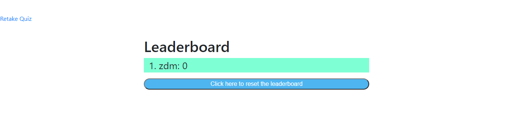

# Homework Week 4 JavaScript Quiz Project

This homework was to create a JavaScript quiz by creating html pages, styling them with CSS and then making them functional with JavaScript. 

## Instructions for use

Upon loading the indext.html the user will be greeted with text welcoming them to the quiz and giving instructions for use built into the page. The view highscores link at the top left will take you to the leaderboard page and the start quiz button navigates to the game html and begins promting the user with questions. The quiz currently contains 7 questions with a 3 minuite timer. Both of these can be manipulated easily through the game.js for more or less questions / time. 

After finishing the quiz the user is prompted to enter their initials to be shown on the leaderboard. If no initials are entered then the submit buttion is inoperable. After entering a valid text and submitting the user is then taken to the highscore page where they will see their score compared to other users. The reset button at the bottom of the leaderboard will reset the scoreboard by clearing out local storage.

If the user runs out of time before the quiz has been completed, they will be directed to the initial entry screen and the score that was attained before the timer expires will be their final score. 

## Notes
 
To add questions or remove simply edit the myQuestions array in the game javascript file. When adding or removing questions the user must also change the variable maxQuestions to the number of questions in the array. If the user would like to change the timer to have more or less time then they must navigate to the init() function and change the variable secondsLeft to the time (in seconds) they would like to have on the quiz. Currently the quiz keeps score by 100 points per question.

## Screenshots
The following images demonstate the web applications apperance and functionality:

## Link to deployed application

Follow this link to access the application live https://zmoore371.github.io/Homework-Week-4/index.html
